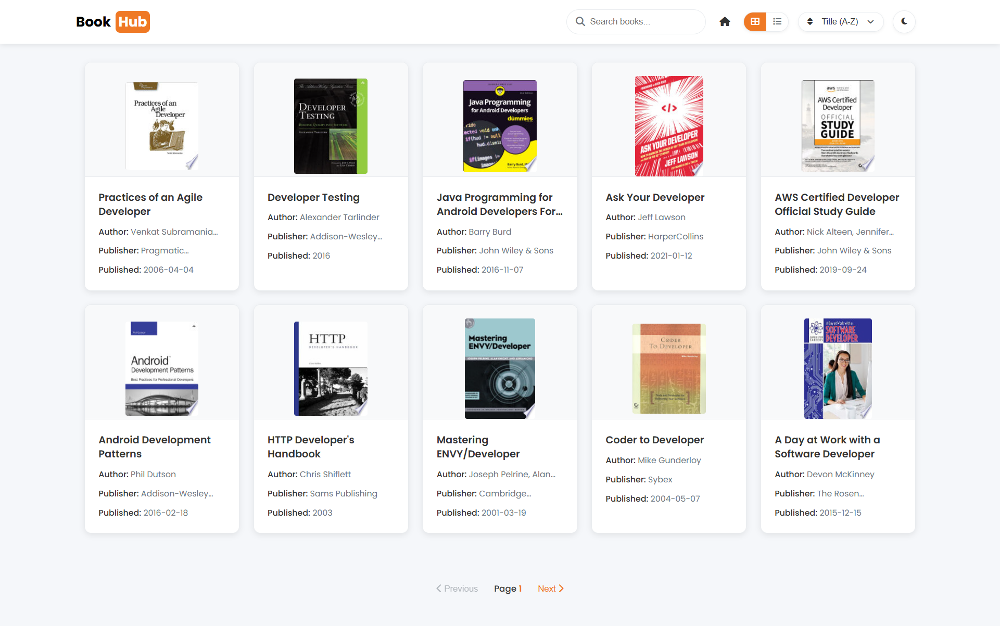
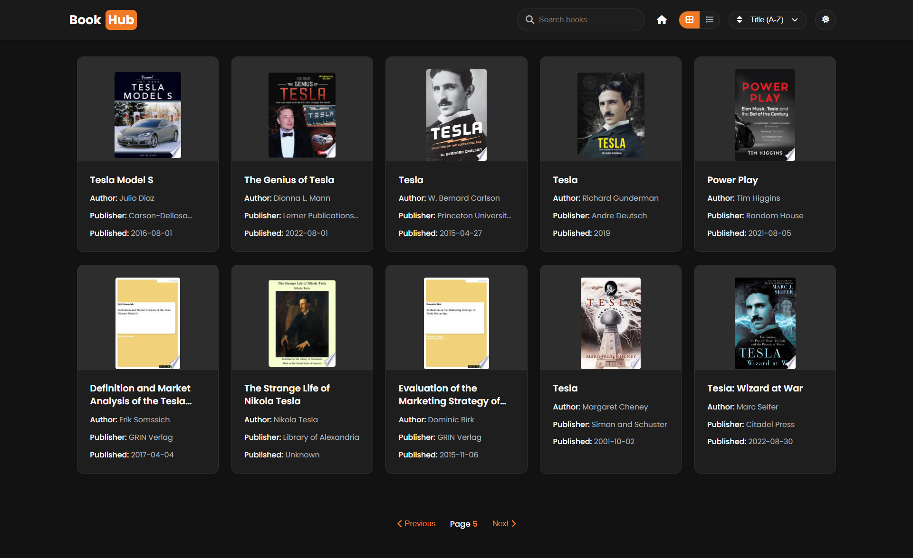

# BookHub

[](https://bookhub-theta.vercel.app/)


BookHub is an elegant and user-friendly book management web app that helps users discover, organize, and track their reading journey. It features a modern UI with **Spotlight Theme** and **Dark Mode**, providing an immersive reading experience.

## 🌟 Features
- 📚 **Book Discovery** – Search and explore books with a clean and interactive interface.
- 📖 **Reading List** – Keep track of books you are currently reading, want to read, or have finished.
- 🔍 **Search & Filter** – Find books by title, author, or category easily.
- 🎨 **Theming** – Supports both **Spotlight Theme** (light mode) and **Dark Mode**.
- 🚀 **Fast & Responsive** – Built with modern web technologies to ensure seamless performance.

## 🎨 Screenshots
### Spotlight Theme


### Dark Theme


## 🛠️ Installation
To run BookHub locally, follow these steps:

```bash
# Clone the repository
git clone https://github.com/devsujalpatel/bookhub.git

cd bookhub
```
Open index.html with Live server 
The app should now be running at port `http://localhost:5500`.

## 🚀 Deployment
BookHub is deployed on **Vercel**. You can check it out here:
🔗 [Live Demo](https://bookhub-theta.vercel.app/)

## 🤝 Contributing
Contributions are welcome! If you have any improvements or bug fixes, feel free to:
1. Fork the repository.
2. Create a new branch (`feature-branch`).
3. Commit your changes.
4. Open a pull request.


---
Made with ❤️ by [Sujal Patel](https://github.com/devsujalpatel)

